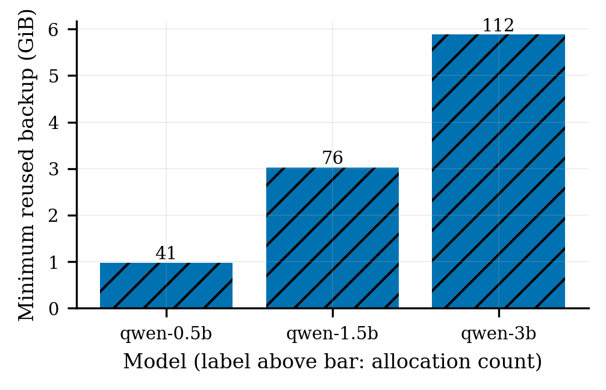

# Backup reuse and reclaim

## Research question and metrics

Does a later L1 sleep reuse an unchanged CPU weight backup without another device-to-host
copy, and can controller-requested release settle both logically and physically?

Reuse requires positive `cpu_backup_reuse_count`, `cpu_backup_reused_bytes == backup_bytes`,
and `copy_d2h_s == 0` for all five sleep events per model. Output after every wake must equal
the reference. Reclaim requires positive run-local coordinator requested/released bytes,
released bytes equal to requested bytes, zero pending bytes/requests, and no host-cache flush
errors.

Logical counters alone do not prove physical reclaim. The runner snapshots coordinator
release counters, process-tree RSS, and host `MemAvailable` before and after wake, then waits
for the asynchronous poller. A physical settlement window must have a positive coordinator
release delta, at least 512 MiB lower process-tree RSS, and at least 512 MiB higher
`MemAvailable`. See the [claims contract](../../../results/backup-reuse-reclaim/config/claims.json).

## Retained result

The 2026-08-13 reuse runs contain five zero-D2H events per model. Minimum reused bytes were
`1,048,576,000`, `3,250,585,600`, and `6,314,524,672`. The pressure run requested and released
`2,097,152,000` bytes with zero pending obligation. In the attributed settlement window,
process-tree RSS fell `1,847,525,376` bytes and `MemAvailable` rose `1,916,854,272` bytes.



- [PDF figure](../../../results/backup-reuse-reclaim/figures/backup-reuse.pdf)
- [JSON summary](../../../results/backup-reuse-reclaim/summary.json)
- [Reclaim evidence](../../../results/backup-reuse-reclaim/raw/vllm-switch/reclaim.json)

## Reproduce the measurement

Run from the repository root on an idle GPU with a compatible vllm-switch checkout. The runner
requires `--vllm-repo` and rejects an imported module outside that checkout.

```bash
uv sync --frozen --group dev

BENCH_ROOT=$PWD
RUN_ROOT="$BENCH_ROOT/results/tmp/backup-reuse-reclaim/run-001"
VLLM_SWITCH_REPO=/path/to/vllm-switch
VLLM_SWITCH_PYTHON="$VLLM_SWITCH_REPO/.venv/bin/python"
MODEL_ROOT=/path/to/models

"$VLLM_SWITCH_PYTHON" -m pip install -e . --no-deps
```

Run one no-pressure control per model. Five iterations are retained, and eager mode removes
CUDA graph/compile differences from this allocator-mechanism experiment.

```bash
for spec in \
  qwen-0.5b:Qwen2.5-0.5B-Instruct:0.45 \
  qwen-1.5b:Qwen2.5-1.5B-Instruct:0.45 \
  qwen-3b:Qwen2.5-3B-Instruct:0.80
do
  name=${spec%%:*}
  remainder=${spec#*:}
  directory=${remainder%%:*}
  utilization=${spec##*:}

  scripts/backup-reuse-reclaim.sh \
    --python "$VLLM_SWITCH_PYTHON" \
    --vllm-repo "$VLLM_SWITCH_REPO" \
    --models "$name=$MODEL_ROOT/$directory" \
    --iterations 5 \
    --no-expect-release \
    --expect-reuse \
    --enforce-eager \
    --gpu-memory-utilization "$utilization" \
    --max-model-len 1024 \
    --dtype float16 \
    --out-dir "$RUN_ROOT/reuse/$name"
done
```

For reclaim, copy the complete one-model controller template and replace its absolute metrics
path. Read the live memory bounds before selecting thresholds:

```bash
CONTROLLER_REPO=/path/to/vllm-switch-controller
CONTROLLER_CONFIG="$RUN_ROOT/reclaim/controller.yaml"

mkdir -p "$RUN_ROOT/reclaim"
cp docs/experiments/backup-reuse-reclaim/controller.example.yaml "$CONTROLLER_CONFIG"
awk '/^(MemTotal|MemAvailable):/ { print }' /proc/meminfo
$EDITOR "$CONTROLLER_CONFIG"
```

Set `cpu_memory_reclaim_available_bytes` and
`cpu_memory_recovery_available_bytes` so that, immediately before launch,
`MemAvailable < reclaim < recovery < MemTotal`. This triggers the policy from a harmless
watermark and does not allocate memory. Abort instead of creating real OOM pressure if those
bounds cannot be satisfied on a shared host. Keep the other controller fields unchanged.

Start the pinned controller, retain its PID, and inspect its initial run-local state:

```bash
git -C "$CONTROLLER_REPO" status --short --branch
sha256sum "$CONTROLLER_CONFIG"

"$CONTROLLER_REPO/.venv/bin/vllm-switch-controller" \
  --config "$CONTROLLER_CONFIG" \
  >"$RUN_ROOT/reclaim/controller.log" 2>&1 &
CONTROLLER_PID=$!

curl --retry 30 --retry-delay 1 --retry-all-errors -fsS \
  http://127.0.0.1:19400/health
curl -fsS http://127.0.0.1:19400/admin/cpu-backup/stats \
  >"$RUN_ROOT/reclaim/initial-controller-stats.json"
```

From the benchmark root, run at least two iterations so the first sleeping backup becomes
safe to release during the next wake. The five-second window allows the background poller and
host allocator flush to settle.

```bash
scripts/backup-reuse-reclaim.sh \
  --python "$VLLM_SWITCH_PYTHON" \
  --vllm-repo "$VLLM_SWITCH_REPO" \
  --models qwen-0.5b="$MODEL_ROOT/Qwen2.5-0.5B-Instruct" \
  --iterations 2 \
  --coordinator-url http://127.0.0.1:19400 \
  --coordinator-repo "$CONTROLLER_REPO" \
  --coordinator-config "$CONTROLLER_CONFIG" \
  --coordinator-timeout-s 1 \
  --post-release-observation-s 5 \
  --expect-release \
  --min-worker-rss-reclaim-bytes 536870912 \
  --enforce-eager \
  --gpu-memory-utilization 0.45 \
  --max-model-len 1024 \
  --dtype float16 \
  --out-dir "$RUN_ROOT/reclaim"

kill -TERM "$CONTROLLER_PID"
wait "$CONTROLLER_PID" || true
```

Stop the controller and verify process/GPU cleanup. Inspect each generated timestamp directory.
Only summaries with `ok: true`, no assertion failures, matching output, the intended imported
vLLM path/commit, the actual controller commit/config digest, and zero no-pressure release
activity are eligible. Preserve failed runs as diagnostics.

## Update `results/`

Point each reuse variable and `RECLAIM` at its generated summary, then dry-run promotion:

```bash
REUSE_05="$RUN_ROOT/reuse/qwen-0.5b/<timestamp>/repeated_sleep_l1_summary.json"
REUSE_15="$RUN_ROOT/reuse/qwen-1.5b/<timestamp>/repeated_sleep_l1_summary.json"
REUSE_3="$RUN_ROOT/reuse/qwen-3b/<timestamp>/repeated_sleep_l1_summary.json"
RECLAIM="$RUN_ROOT/reclaim/<timestamp>/repeated_sleep_l1_summary.json"

scripts/promote.sh backup-reuse-reclaim \
  --candidate-root "$RUN_ROOT/candidate-dry" \
  --collected-at YYYY-MM-DD \
  --reuse qwen-0.5b="$REUSE_05" \
  --reuse qwen-1.5b="$REUSE_15" \
  --reuse qwen-3b="$REUSE_3" \
  --reclaim "$RECLAIM"
```

Review the summary and physical settlement snapshots, then repeat with a new root:

```bash
scripts/promote.sh backup-reuse-reclaim \
  --apply \
  --candidate-root "$RUN_ROOT/candidate-apply" \
  --collected-at YYYY-MM-DD \
  --reuse qwen-0.5b="$REUSE_05" \
  --reuse qwen-1.5b="$REUSE_15" \
  --reuse qwen-3b="$REUSE_3" \
  --reclaim "$RECLAIM"

scripts/build_all.sh backup-reuse-reclaim
uv run python -m vllm_switch_bench.validation.backup_reuse_reclaim.validate
git diff -- results/backup-reuse-reclaim
```

Repeat build/validation and require no second-pass diff. The old result is retained beneath
`$RUN_ROOT/candidate-apply/previous/`.

## Threats and limitations

This is one host/GPU with a small sample. RSS and `MemAvailable` are noisy, allocator reuse
depends on unchanged tensor layout, and settlement depends on poll/debounce timing. A wake
window contains both restore consumption and cooperative release; the paired controller delta
establishes attribution but not allocator-wide causality. The result does not establish
multi-tenant fairness, long-duration stability, or physical return by every host allocator.
