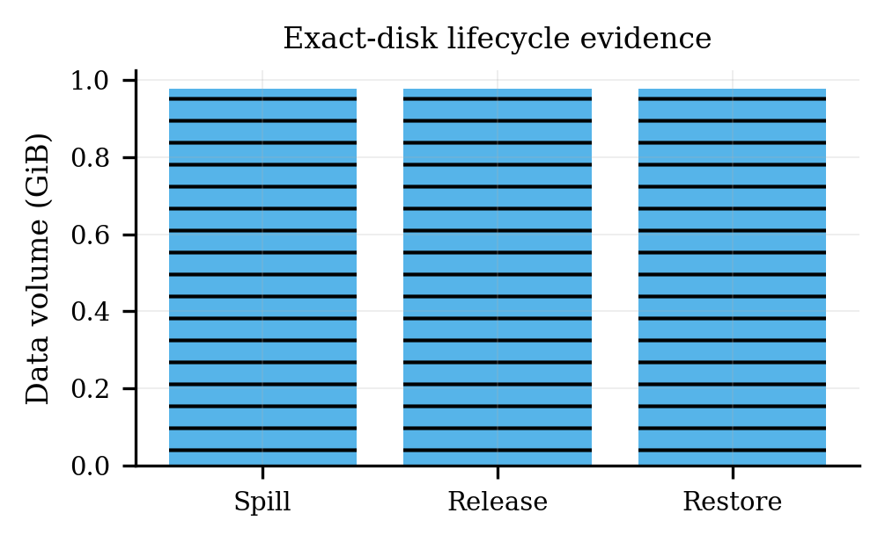

# Exact disk

## Question

Does the exact-disk path spill and physically demote a 1 GiB exact-runtime payload while retaining payload/segment integrity and producing equal output after restoration?

## Metric boundary

The claim covers observed spill bytes, completed demotion/release, on-disk footprint, payload/segment/chunk digests, and before/after output equality. It does not claim a nonzero `disk_reused_bytes` counter where the retained profile reports zero, and it does not include the omitted 1 GiB payload in Git.

## Method

Seven retained files capture the event profile, run metadata, payload hash, runtime bundle manifest, physical disk footprint, manifest commit marker, and output observation. The validator requires spill/demotion/sleep/restore/wake phase coverage, no fallback, a 1,048,576,000-byte payload, contiguous segments and matching sizes, a manifest commit marker equal to the SHA-256 of the exact manifest bytes, valid payload/chunk SHA-256 values and chunk counts, material allocated disk footprint, completed host-cache release and demotion with zero pending bytes, an actual disk read, run identity/config metadata, and equal before/after output.

## Result

The evidence reports 1,048,576,000 spill bytes, the same completed physical release, and a 1,048,576,000-byte disk read during restore. The omitted payload digest is retained, runtime manifest segments sum to the payload size, and the before/after generation observation matches.

## Threats and limitations

- This is one historical exact-runtime payload observation, not a throughput or durability study.
- The payload is deliberately omitted; only its size/digest and bundle/chunk checksums remain.
- Output equality covers the retained deterministic observation, not every prompt or mutation path.
- No new data was generated during the refactor, and the canonical GPU rerun is not complete.
