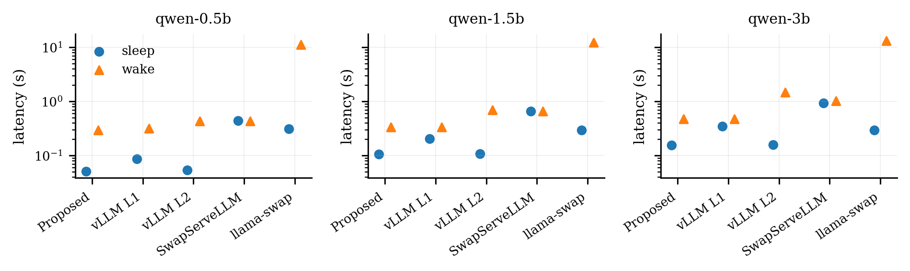

# Lifecycle latency

## Question

How long are the separately defined sleep/evict and wake/restore state-machine phases for three Qwen model sizes across Proposed, vLLM L1, vLLM L2, SwapServeLLM, and llama-swap?

## Metric boundary

The metric is lifecycle state-machine latency in seconds. Sleep and wake remain separate. Request queueing and generation latency are excluded. Each model/system/phase cell has five positive samples; the summary reports the median and the second/fourth sorted observations as `q1_s`/`q3_s`.

## Method

The migrated v0.1 evidence retains 13 raw lifecycle JSON files. The builder selects exactly 3 models × 5 systems × 2 phases and recomputes 30 aggregate cells. The validator enforces the exact matrix, five samples per cell, finite positive timings, output equality, and equality between raw recomputation and the checked-in summary.

SwapServeLLM and the profiled llama-swap executable are not tracked. Their immutable release URL, byte size, and SHA-256 contracts are recorded in family metadata.

## Result

The evidence supports descriptive per-phase latency comparisons only. llama-swap wake intervals are on the order of 11–13 seconds in these rows, while the in-process mechanisms are sub-second to about 1.5 seconds for the retained models. This is not a claim of resource-equivalent fairness across systems.

## Threats and limitations

- Five cycles per cell are exploratory and do not establish population uncertainty or reliability.
- External systems retain different process, CPU-copy, cache, and runtime states.
- Producer-machine paths inside immutable raw files are historical provenance, not current setup instructions.
- No new data was generated during the refactor, and the canonical GPU rerun is not complete.
- Deterministic rebuilding authenticates current raw-to-summary structure; it does not rerun the GPU experiment.
