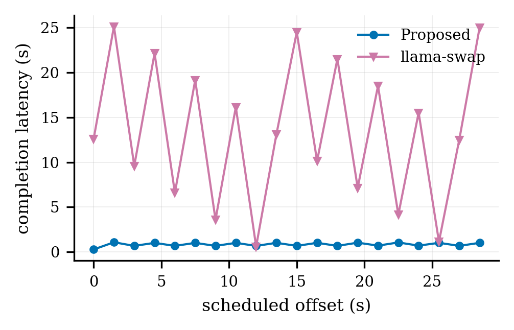

# Request-driven switch

## Research question and metric

**What request-visible completion latency occurs when a frozen open-loop trace alternates
between two models and drives model switching?**

`completion_latency_ms` starts at scheduled
client dispatch and ends at the complete streamed response. Dispatch lag, first byte,
semantic TTFT, and TPOT remain separate raw fields; the summary does not label any of them as
standalone wake time.

A request succeeds only with a 2xx response, no client/SSE error, a complete `[DONE]` marker,
finite non-negative timings, semantic first-token time, and non-empty output. All 20 request
identities and dispatch fields must equal the
[frozen trace](../../../configs/traces/request-switch-alternating.jsonl). A failed trace is
diagnostic output and must not be promoted.

The workload alternates Qwen2.5-1.5B and 3B every 1.5 seconds, requests 32 tokens, and was
replayed once against vllm-switch and llama-swap. Open-loop scheduling means a slow earlier
request does not postpone later dispatches. The [workload contract](../../../results/request-driven-switch/config/workload.json)
defines the retained cardinality and success predicate.

## Retained result

The retained results used an RTX 3080. vllm-switch median
completion latency was `0.842 s` (range `0.287-1.077 s`); llama-swap median was `44.574 s`
(range `24.742-64.351 s`). The latter accumulated substantial open-loop queueing and must not
be read as a native lifecycle wake latency.



- [PDF figure](../../../results/request-driven-switch/figures/request-timeline.pdf)
- [JSON summary](../../../results/request-driven-switch/summary.json)
- [vllm-switch rows](../../../results/request-driven-switch/raw/vllm-switch/e2e-alternating.jsonl)
- [llama-swap rows](../../../results/request-driven-switch/raw/llama-swap/e2e-alternating.jsonl)

## Reproduce the measurement

Run from the repository root. Use absolute paths because the controller launches child
processes from another checkout. Copy the complete vllm-switch template, replace every
`/absolute/path/...` placeholder, and keep model names, ports, eager mode, dtype, maximum
length, utilization, sleep level, policy, and timeouts unchanged.

```bash
uv sync --frozen --group dev

BENCH_ROOT=$PWD
RUN_ROOT="$BENCH_ROOT/results/tmp/request-driven-switch/run-001"
CONTROLLER_REPO=/path/to/vllm-switch-controller
VLLM_SWITCH_REPO=/path/to/vllm-switch
VLLM_SWITCH_CONFIG="$RUN_ROOT/vllm-switch/config.yaml"
VLLM_SWITCH_EXECUTABLE="$CONTROLLER_REPO/.venv/bin/vllm-switch-controller"
VLLM_SWITCH_PID_FILE="$RUN_ROOT/vllm-switch/pids.json"

mkdir -p "$RUN_ROOT/vllm-switch"
cp docs/experiments/request-driven-switch/vllm-switch.example.yaml "$VLLM_SWITCH_CONFIG"
$EDITOR "$VLLM_SWITCH_CONFIG"
```

Start the controller, then use its ownership-aware launcher to prepare both backends. Do not
start the benchmark until launcher completion and all four checks succeed. `/health` is
controller-local, whereas the backend checks establish actual engine readiness/state.

```bash
"$VLLM_SWITCH_EXECUTABLE" --config "$VLLM_SWITCH_CONFIG" \
  >"$RUN_ROOT/vllm-switch/controller.log" 2>&1 &
CONTROLLER_PID=$!

"$CONTROLLER_REPO/.venv/bin/vllm-switch-launch" \
  --config "$VLLM_SWITCH_CONFIG" \
  --pid-file "$VLLM_SWITCH_PID_FILE"

curl -fsS http://127.0.0.1:19300/health
curl -fsS http://127.0.0.1:19300/admin/state \
  >"$RUN_ROOT/vllm-switch/initial-state.json"
curl -fsS http://127.0.0.1:19301/health
curl -fsS http://127.0.0.1:19302/health

scripts/request-driven-switch.sh \
  --base-url http://127.0.0.1:19300 \
  --manifest configs/traces/request-switch-alternating.jsonl \
  --output "$RUN_ROOT/vllm-switch/alternating.jsonl" \
  --runtime-repo "$CONTROLLER_REPO" \
  --runtime-repo "$VLLM_SWITCH_REPO" \
  --runtime-file "$VLLM_SWITCH_EXECUTABLE" \
  --runtime-file "$VLLM_SWITCH_CONFIG" \
  --timeout-s 600

"$CONTROLLER_REPO/.venv/bin/vllm-switch-stop" \
  --pid-file "$VLLM_SWITCH_PID_FILE"
kill -TERM "$CONTROLLER_PID"
wait "$CONTROLLER_PID" || true
```

After port 19300-19302 and all run-owned GPU processes are gone, prepare llama-swap. Copy the
complete template and replace all placeholders. The vLLM checkout must match the Python
executable embedded in `cmd` and `PATH`. Build and hash the pinned router binary:

```bash
LLAMA_REPO=/path/to/llama-swap
VLLM_REPO=/path/to/vllm
LLAMA_CONFIG="$RUN_ROOT/llama-swap/config.yaml"
LLAMA_BINARY="$LLAMA_REPO/build/llama-swap"

mkdir -p "$RUN_ROOT/llama-swap"
cp docs/experiments/request-driven-switch/llama-swap.example.yaml "$LLAMA_CONFIG"
$EDITOR "$LLAMA_CONFIG"

(
  cd "$LLAMA_REPO"
  go build -o "$LLAMA_BINARY" .
)

"$LLAMA_BINARY" \
  --config "$LLAMA_CONFIG" \
  --listen 127.0.0.1:19500 \
  >"$RUN_ROOT/llama-swap/server.log" 2>&1 &
LLAMA_PID=$!

curl --retry 120 --retry-delay 1 --retry-all-errors -fsS \
  http://127.0.0.1:19500/v1/models

scripts/request-driven-switch.sh \
  --base-url http://127.0.0.1:19500 \
  --manifest configs/traces/request-switch-alternating.jsonl \
  --output "$RUN_ROOT/llama-swap/alternating.jsonl" \
  --runtime-repo "$LLAMA_REPO" \
  --runtime-repo "$VLLM_REPO" \
  --runtime-file "$LLAMA_BINARY" \
  --runtime-file "$LLAMA_CONFIG" \
  --timeout-s 600

kill -TERM "$LLAMA_PID"
wait "$LLAMA_PID" || true
```

The runner writes a sibling `alternating.run.json` manifest even when a request fails. Inspect
both JSONL files for exactly 20 rows and zero errors, then inspect both run manifests for the
intended commits, dirty states, working-tree fingerprints, configuration/executable hashes,
and trace hash. Confirm run-owned ports, processes, and GPU allocations are gone.

## Update `results/`

Stage and validate a complete two-system candidate before changing tracked results:

```bash
scripts/promote.sh request-driven-switch \
  --candidate-root "$RUN_ROOT/candidate-dry" \
  --collected-at YYYY-MM-DD \
  --vllm-switch "$RUN_ROOT/vllm-switch/alternating.jsonl" \
  --llama-swap "$RUN_ROOT/llama-swap/alternating.jsonl"
```

The promoter copies each JSONL file and its sibling `.run.json`, rebuilds the summary/figure,
and validates strict request success and frozen trace equality. Review the candidate, then:

```bash
scripts/promote.sh request-driven-switch \
  --apply \
  --candidate-root "$RUN_ROOT/candidate-apply" \
  --collected-at YYYY-MM-DD \
  --vllm-switch "$RUN_ROOT/vllm-switch/alternating.jsonl" \
  --llama-swap "$RUN_ROOT/llama-swap/alternating.jsonl"

scripts/build_all.sh request-driven-switch
uv run python -m vllm_switch_bench.validation.request_driven_switch.validate
git diff -- results/request-driven-switch
```

Repeat build/validation and require no second-pass diff. The previous result remains under
`$RUN_ROOT/candidate-apply/previous/`.

## Threats and limitations

This is one host/GPU, one trace, one prompt shape, and one pass. It does not cover other
arrival rates, concurrency, model counts, or failure recovery. Completion latency combines
queueing, routing, activation, and inference.
