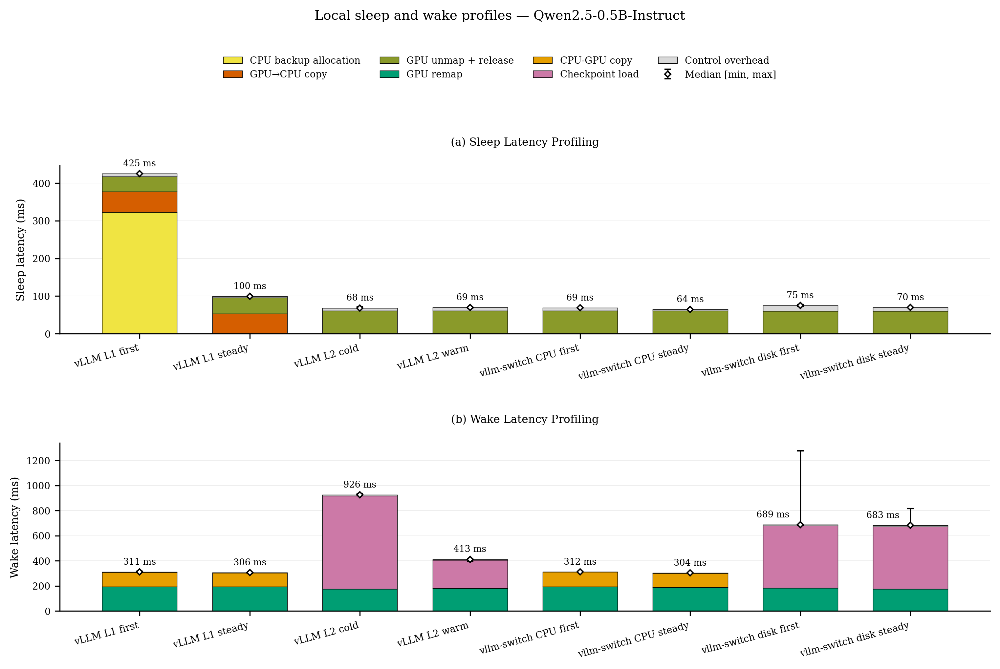

# vLLM profiling

## Research question and metrics

This experiment profiles the sleep/wake phases of native vLLM L1/L2 and vllm-switch
CPU/exact-disk, explicitly distinguishing:

- the first and steady-state L1/CPU/exact-disk cycles within the same process;
- cold and warm page-cache conditions for vLLM L2;
- contiguous total wake latency and its internal active phases.

Sleep latency starts when process termination or sleep is initiated and ends when the
process exits or the sleep call returns. Wake latency starts when the process is launched or
the first restore call begins and ends when all restore phases have returned. Inference and
L2 cache treatment are excluded from wake latency. The L2 wake total uses one contiguous
outer timer spanning `wake(weights) -> reload_weights -> wake(kv_cache)`, rather than the
sum of the three HTTP/RPC active times.

Each mechanism runs in three independent process blocks, with three sleep/wake cycles per
block. The median and min/max are reported across blocks:

- first: cycle 0 from each block;
- steady: the arithmetic mean of the two subsequent cycles in each block;
- L2 cold: one validated cold cycle from each block;
- L2 warm: the arithmetic mean of the two warm cycles in each block.

Each stacked bar uses the real sample closest to the cross-block median for that operation.
The phases must close to the contiguous wall time. Exact-disk read, hash, and H2D operations
run concurrently, so the pipeline wall time is used instead of summing worker times.

## L2 page-cache treatment

The three L2 blocks rotate the position of the cold cycle:

```text
block 0: cold, warm, warm
block 1: warm, cold, warm
block 2: warm, warm, cold
```

Cold treatment calls `POSIX_FADV_DONTNEED` only for local `*.safetensors` files. It does not
modify the system-wide cache or use `/proc/sys/vm/drop_caches`. Treatment and validation
occur after L2 sleep completes and before the wake timer starts.

A cold sample must satisfy both of the following conditions:

- the `mincore` resident ratio is at most 5% before wake;
- process-tree physical read bytes during the timed wake are at least 90% of checkpoint
  bytes.

A warm sample must satisfy both of the following conditions:

- the resident ratio is at least 90% before wake;
- physical read bytes are at most 10% of checkpoint bytes.

A cycle that fails these conditions is marked invalid and excluded from the retained
result.

## Frozen scope

The frozen workload is Qwen2.5-0.5B-Instruct, float16, maximum model length
1024, eager execution, 0.80 GPU memory utilization, and one RTX 3080. Native vLLM and
vllm-switch use the same upstream base. The actual engine commit, Python, Torch, CUDA, and
imported module path for each are recorded in the source provenance.

## Retained result



- [JSON summary](../../../results/vllm-profiling/summary.json)
- [Compact per-block samples](../../../results/vllm-profiling/raw/profile-samples.json)
- [PDF figure](../../../results/vllm-profiling/figures/vllm-profiling.pdf)

## Reproduce the measurement

Run from the repository root with an idle GPU. Set the following variables to valid local
paths:

```bash
uv sync --frozen --group dev

BENCH_ROOT=$PWD
RUN_ROOT="$BENCH_ROOT/results/tmp/vllm-profiling/run-001"
MODEL=/path/to/Qwen2.5-0.5B-Instruct
VLLM_REPO=/path/to/native-vllm-profiling
VLLM_PYTHON=/path/to/native-vllm-python
VLLM_SWITCH_REPO=/path/to/vllm-switch
VLLM_SWITCH_PYTHON="$VLLM_SWITCH_REPO/.venv/bin/python"
export CUDA_HOME=/path/to/cuda
```

Both engine checkouts must be runnable source trees, not source-only clones. In particular,
the selected Python environment must provide ABI-compatible compiled vLLM extension modules.
Check the imported source and extension paths before starting the GPU run:

```bash
PYTHONPATH="$VLLM_REPO" "$VLLM_PYTHON" -c \
  'import pathlib, vllm, vllm._C; print(pathlib.Path(vllm.__file__).resolve()); print(pathlib.Path(vllm._C.__file__).resolve())'
PYTHONPATH="$VLLM_SWITCH_REPO" "$VLLM_SWITCH_PYTHON" -c \
  'import pathlib, vllm, vllm._C; print(pathlib.Path(vllm.__file__).resolve()); print(pathlib.Path(vllm._C.__file__).resolve())'
```

For each command, verify that the first path belongs to the declared checkout and that the
extension path identifies the compatible build intended for that checkout.

The cold-process reference uses three independent processes:

```bash
scripts/vllm-profiling.sh \
  --model "$MODEL" \
  --served-model-name qwen-0.5b \
  --python "$VLLM_PYTHON" \
  --workdir "$VLLM_REPO" \
  --methods cold_reload \
  --prompts short_short \
  --repeats 3 \
  --ready-timeout-s 360 \
  --gpu-memory-utilization 0.80 \
  --max-model-len 1024 \
  --dtype float16 \
  --enforce-eager \
  --out-dir "$RUN_ROOT/cold"
```

Native vLLM L1/L2 uses three process blocks with three cycles each:

```bash
scripts/vllm-profiling.sh \
  --model "$MODEL" \
  --served-model-name qwen-0.5b \
  --python "$VLLM_PYTHON" \
  --workdir "$VLLM_REPO" \
  --methods sleep_l1 sleep_l2 \
  --prompts short_short \
  --repeats 3 \
  --cycles-per-process 3 \
  --ready-timeout-s 360 \
  --gpu-memory-utilization 0.80 \
  --max-model-len 1024 \
  --dtype float16 \
  --enforce-eager \
  --idle-s 0 \
  --out-dir "$RUN_ROOT/vllm"
```

vllm-switch CPU/exact-disk uses the same block/cycle harness:

```bash
scripts/vllm-profiling.sh \
  --model "$MODEL" \
  --served-model-name qwen-0.5b \
  --python "$VLLM_SWITCH_PYTHON" \
  --workdir "$VLLM_SWITCH_REPO" \
  --methods cpu_backup exact_disk \
  --prompts short_short \
  --repeats 3 \
  --cycles-per-process 3 \
  --ready-timeout-s 360 \
  --gpu-memory-utilization 0.80 \
  --max-model-len 1024 \
  --dtype float16 \
  --enforce-eager \
  --idle-s 0 \
  --out-dir "$RUN_ROOT/vllm-switch"
```

The cold summary must contain exactly three rows with `ok=true`. Each mechanism block must
have a `block-summary.json`, `ok=true`, three cycles, equal outputs, and passing L2 cache
evidence.

## Update `results/`

```bash
COLD_SUMMARY="$RUN_ROOT/cold/<timestamp>/summary.json"
VLLM_BLOCKS="$RUN_ROOT/vllm/<timestamp>"
SWITCH_BLOCKS="$RUN_ROOT/vllm-switch/<timestamp>"

scripts/promote.sh vllm-profiling \
  --candidate-root "$RUN_ROOT/candidate-dry" \
  --collected-at YYYY-MM-DD \
  --cold-summary "$COLD_SUMMARY" \
  --vllm-blocks "$VLLM_BLOCKS" \
  --switch-blocks "$SWITCH_BLOCKS"
```

The promoter builds and semantically validates the candidate before it returns. After
reviewing that candidate, use a new candidate root to apply it:

```bash
scripts/promote.sh vllm-profiling \
  --apply \
  --candidate-root "$RUN_ROOT/candidate-apply" \
  --collected-at YYYY-MM-DD \
  --cold-summary "$COLD_SUMMARY" \
  --vllm-blocks "$VLLM_BLOCKS" \
  --switch-blocks "$SWITCH_BLOCKS"
```

Build and validate twice, recording hashes after each pass. Matching hash manifests show
that the retained artifacts are stable while still allowing the intentional result update
to remain visible in `git diff`:

```bash
scripts/build_all.sh vllm-profiling
uv run python -m vllm_switch_bench.validation.vllm_profiling.validate
find results/vllm-profiling -type f -print0 | sort -z | \
  xargs -0 sha256sum > "$RUN_ROOT/results-first-pass.sha256"

scripts/build_all.sh vllm-profiling
uv run python -m vllm_switch_bench.validation.vllm_profiling.validate
find results/vllm-profiling -type f -print0 | sort -z | \
  xargs -0 sha256sum > "$RUN_ROOT/results-second-pass.sha256"

cmp "$RUN_ROOT/results-first-pass.sha256" "$RUN_ROOT/results-second-pass.sha256"
git diff -- results/vllm-profiling
```

## Threats and limitations

This experiment covers only one model, one host/GPU, and three independent process blocks.
The allocator, driver, filesystem, and other activity on the shared server can still affect
the result. `POSIX_FADV_DONTNEED` is advisory, so cold/warm classification depends on actual
`mincore` and physical-read evidence rather than the success of the system call alone. The
retained provenance records the engine commit, Python path/version, Torch/CUDA versions, and
vLLM source import path, but it does not digest the loaded `vllm._C` shared object; the
preflight extension-path check remains operator-reviewed rather than retained evidence. The
result does not establish throughput, capacity, tail latency, or general system superiority.
