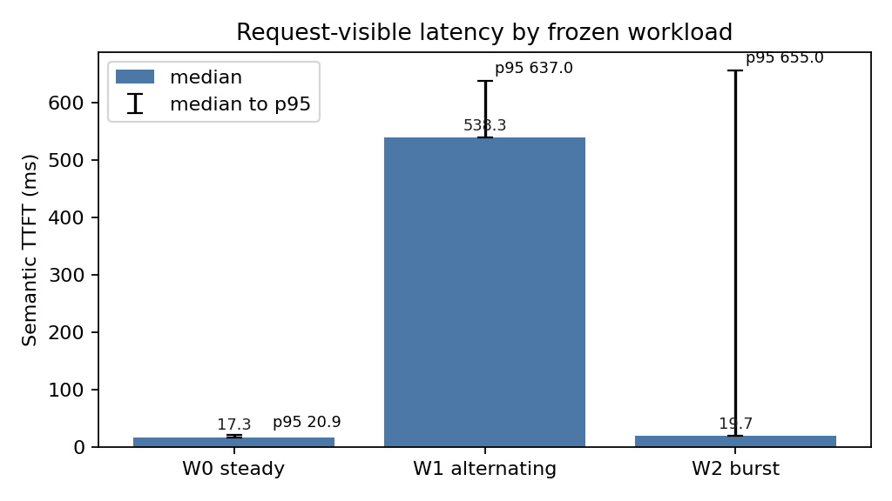
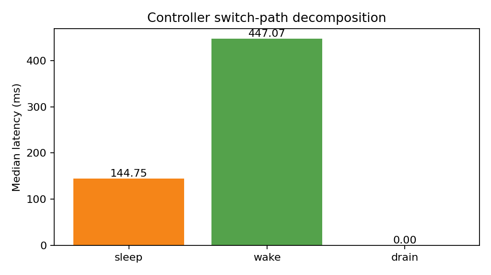
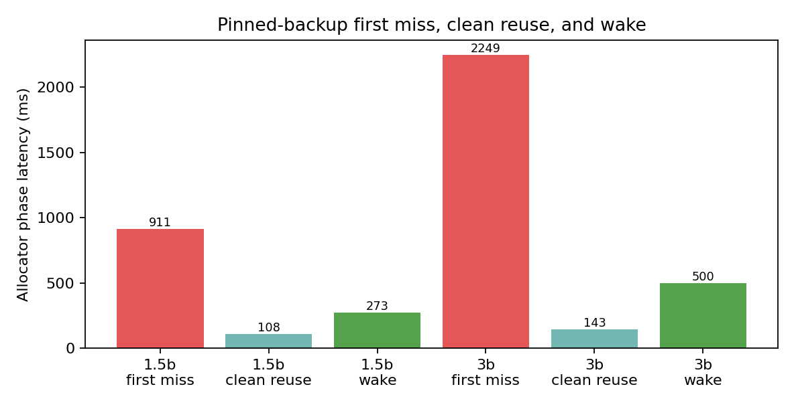
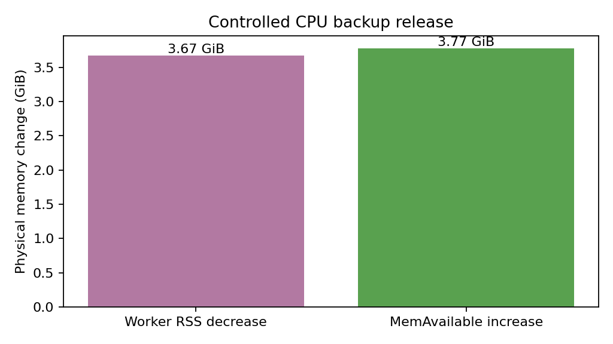

# 请求驱动的多模型快速切换：阶段实验报告

## 1. 结论

本阶段完成了一个最小、可运行的研究原型：用户只向统一的 OpenAI-compatible API 发送请求，并通过请求体中的 `model` 字段选择模型；controller 自动保护活跃请求，按需 sleep 当前 vLLM engine、wake 目标 engine，再转发推理请求。vLLM 的 CPU pinned backup pool 负责权重备份、clean reuse 和压力回收，controller 不复制权重管理逻辑。

在单张 RTX 3080 10 GiB 上，Qwen2.5-1.5B-Instruct 与 Qwen2.5-3B-Instruct 的真实双模型池运行成功。三次独立的冻结 workload 重放共 180 个请求，全部成功：

| workload | 语义 TTFT median / p95 | E2E median / p95 | 解释 |
|---|---:|---:|---|
| W0 steady，A×20 | 17.3 / 20.9 ms | 190.5 / 212.2 ms | 无切换，controller fast path |
| W1 alternating，A/B×10 | 538.3 / 637.0 ms | 791.2 / 967.6 ms | 每个请求触发切换，机制上限 |
| W2 burst，A×5/B×5/A×5/B×5 | 19.7 / 655.0 ms | 349.3 / 1030.7 ms | 大多数同模型请求是 steady hit，组边界产生长尾 |

W0 的 direct vLLM 与 controller 对照分别为 16.4/17.6 ms 和 17.3/19.9 ms（TTFT median/p95），说明无切换代理开销很小。该结果不是吞吐或生产 SLO 结论；它只验证低 offered load 下请求驱动切换的可行性。

## 2. 系统实现

### Controller

- sleep/wake 后轮询 `/is_sleeping`，使用整个 lifecycle 的单一 deadline；
- 推理请求和 lifecycle 分别使用 `request_timeout_s` 与 `switch_timeout_s`；
- launcher 使用 `launch A → sleep A → launch B → sleep B → wake startup model`，避免初始化时同时占满 GPU；
- readiness 与 request reservation 在同一 `switch_lock` 临界区内；
- streaming 正常完成、异常和客户端断连都释放 reservation；
- 记录 `switch_id`、`queue_wait_ms`、`request_drain_ms`、sleep/wake/switch latency。

### Benchmark

`llm-switch-bench` 新增：

- 冻结 JSONL manifest；
- 基于绝对 monotonic offset 的 open-loop async runner；
- 一个共享 `httpx.AsyncClient`；
- 按 SSE event boundary 解析；
- 区分 transport first byte 与 semantic TTFT；
- 保留 HTTP failure、broken stream 和 timeout；
- W0/W1/W2 重复矩阵、汇总和四张图。

冻结 manifest 校验和见 `results/request_switch/latest/summary.json`。

## 3. RQ1：统一 API 的无切换开销是否足够小？

W0 每次独立运行 20 个请求，共三次：

| path | requests | semantic TTFT median | p95 | E2E median | p95 |
|---|---:|---:|---:|---:|---:|
| direct vLLM | 60 | 16.4 ms | 17.6 ms | 189.6 ms | 190.7 ms |
| controller | 60 | 17.3 ms | 19.9 ms | 190.5 ms | 193.5 ms |

median TTFT 的差值约 0.9 ms，median E2E 的差值约 0.9 ms。在当前单机 localhost 场景，统一 OpenAI API 代理本身不是主要瓶颈。



## 4. RQ2：请求驱动切换的成本由什么组成？

一次完整实验会话中记录了 349 个 OpenAI 请求，其中 118 次 switch、231 次 steady hit。所有 switch 的中位数分解为：

- sleep：144.8 ms；
- wake：447.1 ms；
- active-request drain：0.005 ms；
- 完整 controller switch path：581.7 ms。

该统计包含 smoke、W0/W1/W2 与压力实验，主要用于机制分解，不等同于单条 workload 的独立样本。低 offered load 下 drain 接近零；针对活跃 streaming 请求的自动化并发测试验证了 B 必须等 A 完成后才能 sleep A。



W1 的 semantic TTFT median 为 538.3 ms，接近 controller switch path 的量级。W2 中大多数请求复用当前模型，因此 median 只有 19.7 ms；但是四个模型组边界仍造成 655.0 ms 的 p95。访问 locality 能显著降低每请求摊销切换成本，但不能消除边界长尾。

## 5. RQ3：CPU pinned backup reuse 是否有效？

allocator profile 给出明确的 first-miss 与 clean-reuse 对照：

| model | first sleep miss | D2H | pinned alloc | clean reuse sleep median | reuse D2H | wake median / H2D |
|---|---:|---:|---:|---:|---:|---:|
| Qwen2.5-1.5B | 911.3 ms | 168.6 ms | 702.9 ms | 107.7 ms | 0 | 273.4 / 176.3 ms |
| Qwen2.5-3B | 2249.2 ms | 335.4 ms | 1885.0 ms | 143.2 ms | 0 | 499.9 / 386.6 ms |

1.5B 和 3B 分别观察到 57 和 59 次 clean reuse sleep；每次复用 3.03 GiB 和 5.88 GiB 权重备份，`copy_d2h_s=0`。因此优化消除的是后续 sleep 的 pinned allocation 与 D2H，不是 wake 的 H2D。



upstream vLLM L1 baseline 使用固定 commit `0decac0d96c42b49572498019f0a0e3600f50398` 建立独立 worktree，但无法在现有共享二进制环境启动：upstream Python 需要自己的 `_vllm_fa2_C/_vllm_fa3_C`，当前 venv 中是研究 checkout 构建的扩展。按计划没有做兼容性移植；因此报告 within-process first miss vs clean reuse，而不把它冒充 upstream baseline。

历史、同模型的 lifecycle 背景数据表明：cold reload 的 restore median 约为 16.5 s（1.5B）和 19.0 s（3B）；它们不是本次冻结 W1/W2 的 E2E 结果，不能与 581.7 ms switch path 作为严格同表排名。

## 6. RQ4：backup 能否在压力下物理回收？

### P0：无压力保留

在 memory-pressure monitor 的 normal 状态，`A→B→A→B→A` 后：

- 1.5B clean backup 保留 3,250,585,600 bytes；
- `requested_release_bytes_total=0`；
- `released_bytes_total=0`；
- 3 秒窗口内该 worker RSS 不变；
- 后续 clean sleep 继续 `copy_d2h_s=0`。

### P1：受控回收

没有在共享服务器上申请大量 RAM，而是对 awake 模型的 cache-only backup 发出精确 release request：

- queued/released：3,250,585,600 bytes；
- 1.5B worker RSS：5,904,871,424 → 1,960,157,184 bytes，下降 3.67 GiB；
- host `MemAvailable`：38,082,461,696 → 42,149,920,768 bytes，上升 3.79 GiB；
- pending release：0；
- 再次回切后下一次 sleep 出现 pinned allocation 713.7 ms、D2H 169.2 ms，证明 cache miss 路径恢复；
- 再下一次 clean sleep 又恢复 `copy_d2h_s=0`。

因此逻辑计数、进程物理 RSS 与 host memory 三层证据一致。



`results/profiling/physical_reclaim_validation.json` 还保存了此前使用正式 repeated-sleep harness 的单次受控压力/no-pressure 验证；本次新 P0/P1 原始证据保存在 ignored tmp，curated 摘要位于 `results/request_switch/latest/pressure-evidence.json`。

## 7. 外部相关系统

### kvcached

固定源码 commit `623dbf2642dce1f9d27a154b7367605d26221c3c`。官方 vLLM image（digest `sha256:e173...bb73`）在 RTX 3080 上完成了真实 smoke：

- kvcached 0.1.5、vLLM 0.19.0、PyTorch 2.10.0+cu129；
- 6 个 vLLM patch 成功应用；
- 2 MiB page 的 elastic KV allocator 初始化；
- OpenAI chat completion 返回有效答案。

但该 image 在 `--enable-sleep-mode` 下未暴露 `/sleep` 与 `/is_sleeping`，而当前官方 controller 的 request-triggered wake 路径依赖这些 endpoint，因此没有得到同一 W1/W2 的 multi-engine switch micro 结果。该 smoke 只验证 Prism-like elastic KV 机制在本卡可运行。22.4 GB image 使共享 root filesystem 达到 100%，验证后已删除，恢复 43 GB 空间。

### ServerlessLLM 与 SwapServeLLM

仓库已有同模型历史 lifecycle 结果：1.5B short-short 中，ServerlessLLM scale-to-zero restore 约 12.1 s，SwapServeLLM swap-in 约 0.74 s。由于它们没有使用本次统一 adapter 与冻结 manifest，这里只将其作为机制背景，不和 M3 request-visible TTFT 合并排名。

### Prism artifact

固定 Prism commit `595ec1f170e75a43897a7a2ad58ac5a9820aa2e8` 与 `prism/shm` kvcached commit `d78649d0c2b7d2ff32eb48a423df7bf60054f4c9`。官方 SGLang `v0.3.4.post2-cu121` image 能识别 RTX 3080，Prism 源码也能进入 multi-model import；安装 Redis 依赖后，下一门槛是构建旧 `prism/shm` CUDA extension 和 editable SGLang fork。考虑 shared disk 曾被 kvcached image 填满，且单 GPU 无法体现 Prism 的 NVLink parallel loading 与多 GPU placement，按预先 gate 停止，没有生成或引用 Prism 性能数值。

## 8. 有效性边界

1. 这是单 GPU、两个小模型、低 offered load 的机制原型，不是生产 serving scheduler。
2. W1 是刻意构造的 worst-case alternating；W2 只是说明 locality，不代表生产 trace。
3. request-level 矩阵每种 workload 三次，但 CPU pressure curated 结果仍是小规模本机观察，不应称为 paper-grade statistical evidence。
4. 当前方案是 temporal sharing；Prism 同时做 GPU KV ballooning、空间+时间共享、placement 和 slack-aware scheduling。不能比较 RTX 3080 与其 H100/NVLink 论文绝对数值。
5. cold reload、ServerlessLLM、SwapServeLLM 的历史 lifecycle 数据与本次 frozen trace schema 不同，只作背景。

## 9. 复现入口

```bash
# Controller repo
uv run python -m controller.main --config configs/models.request_switch.local.yaml
uv run python -m scripts.launch_vllm_pool \
  --config configs/models.request_switch.local.yaml \
  --pid-file results/tmp/request-switch/pids.json

# Benchmark repo
.venv/bin/python scripts/run_request_switch_matrix.py \
  --base-url http://127.0.0.1:9000 \
  --repeats 3 \
  --out-dir results/tmp/request-switch/proposed

.venv/bin/python src/tool/analyze_request_switch.py \
  --input-dir results/tmp/request-switch/proposed \
  --output results/tmp/request-switch/proposed/summary.json
```

机器专属路径只保存在 gitignored `configs/*.local.yaml`；可提交的模型无关示例为 `configs/models.request_switch.example.yaml`。
